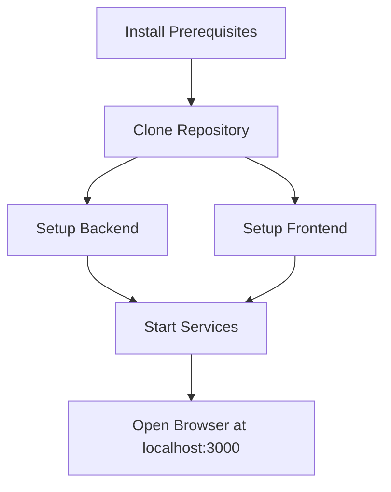

I apologize for the misunderstanding. You're right - I should be providing complete, independent Markdown files for each document. Let me create comprehensive standalone files for each document you requested.

# README.md

# ManzAI Studio

ManzAI Studio is a web application that generates and performs manzai (Japanese comedy) scripts using local LLMs and voice synthesis. It features Live2D character animations that sync with audio for a complete entertainment experience, all running locally on your machine.

## Key Features

- **AI-Powered Script Generation**: Create manzai scripts on any topic using locally running LLMs
- **Text-to-Speech Synthesis**: Convert generated scripts into natural-sounding voices
- **Live2D Character Animation**: Characters perform with synchronized lip movements
- **Completely Local Operation**: No internet connection required after setup
- **Customizable Models & Prompts**: Add your own Live2D models and customize generation prompts

## Quick Installation



### Prerequisites

- Python 3.10+
- Node.js 18+
- Docker (recommended for easy setup)
- Ollama and VoiceVox (automatically installed via Docker)

### Setup Using Docker (Recommended)

```bash
# Clone the repository
git clone https://github.com/yourusername/manzai-studio.git
cd manzai-studio

# Start with Docker Compose
docker-compose up -d
```

Access the application at http://localhost:3000

### Manual Setup

```bash
# Set up Python environment
pyenv install 3.10.13
pyenv local 3.10.13
poetry install

# Set up frontend
cd frontend
npm install
npm run dev

# In another terminal, start backend
poetry run start
```

## Documentation

- [Architecture Overview](docs/ARCHITECTURE.md)
- [API Documentation](docs/API_DOCUMENTATION.md)
- [Development Setup](docs/DEVELOPMENT_SETUP.md)
- [Product Requirements](docs/PRD.md)
- [Contributing Guidelines](docs/CONTRIBUTING.md)

## License

This project is licensed under the MIT License - see the [LICENSE](LICENSE) file for details.