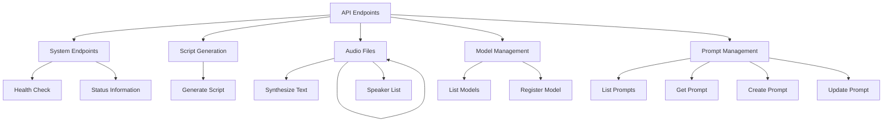

# API_DOCUMENTATION.md

# ManzAI Studio API Documentation

This document describes the REST API endpoints provided by ManzAI Studio's backend service.

## API Overview

The ManzAI Studio API follows RESTful design principles and uses JSON for request and response bodies. All endpoints are prefixed with `/api`.

## Authentication

The API is designed for local use and does not currently implement authentication.

## Base URL

When running locally, the API base URL is:
```
http://localhost:5000/api
```

## Endpoint Categories



## Core Endpoints

### System Status

#### `GET /api/health`

Check the health status of the API.

**Response**
```json
{
  "status": "healthy"
}
```

#### `GET /api/detailed-status`

Get detailed status information about all services.

**Response**
```json
{
  "timestamp": "2025-03-21T12:00:00.000Z",
  "ollama": {
    "available": true,
    "models": ["gemma3:4b", "llama2"],
    "base_url": "http://localhost:11434"
  },
  "voicevox": {
    "available": true,
    "speakers_count": 10,
    "error": null
  },
  "system": {
    "platform": "Linux x86_64",
    "memory_available": 8589934592
  }
}
```

### Script Generation

#### `POST /api/generate`

Generate a manzai script based on a topic.

**Request**
```json
{
  "topic": "スマートフォン",
  "model": "gemma3:4b"
}
```

**Response**
```json
{
  "topic": "スマートフォン",
  "script": [
    {
      "role": "tsukkomi",
      "text": "今日のテーマはスマートフォンについてだね。"
    },
    {
      "role": "boke",
      "text": "僕、新しいの買ったんですよー！"
    }
  ],
  "audio_data": [
    {
      "role": "tsukkomi",
      "text": "今日のテーマはスマートフォンについてだね。",
      "audio_file": "/api/audio/20250321_1.wav"
    },
    {
      "role": "boke", 
      "text": "僕、新しいの買ったんですよー！",
      "audio_file": "/api/audio/20250321_2.wav"
    }
  ]
}
```

### Voice Synthesis

#### `POST /api/synthesize`

Synthesize speech from text.

**Request**
```json
{
  "script": [
    {
      "speaker": "ツッコミ",
      "text": "こんにちは",
      "speaker_id": 1
    }
  ]
}
```

**Response**
```json
{
  "audio_data": [
    {
      "speaker": "ツッコミ",
      "text": "こんにちは",
      "audio_file": "/api/audio/20250321_1.wav"
    }
  ]
}
```

#### `GET /api/speakers`

Get a list of available voices.

**Response**
```json
{
  "speakers": [
    {
      "name": "四国めたん",
      "styles": [
        {
          "id": 2,
          "name": "ノーマル"
        }
      ]
    }
  ]
}
```

### Model Management

#### `GET /api/models/live2d`

Get a list of available Live2D models.

**Response**
```json
{
  "models": [
    {
      "id": "tsukkomi_default",
      "name": "ツッコミ役デフォルト",
      "path": "/live2d/models/tsukkomi_default/model.json",
      "type": "tsukkomi",
      "thumbnail": "/live2d/models/tsukkomi_default/thumbnail.png"
    },
    {
      "id": "boke_default",
      "name": "ボケ役デフォルト",
      "path": "/live2d/models/boke_default/model.json",
      "type": "boke",
      "thumbnail": "/live2d/models/boke_default/thumbnail.png"
    }
  ]
}
```

#### `POST /api/models/live2d/register`

Register a new Live2D model.

**Request** (multipart/form-data)
- `id` (string): Model ID
- `name` (string): Model name
- `type` (string): Model type (tsukkomi, boke, unknown)
- `model_file` (file): Model file (.model3.json or .zip)
- `thumbnail` (file, optional): Thumbnail image

**Response**
```json
{
  "success": true,
  "message": "モデル custom_model が登録されました",
  "model": {
    "id": "custom_model",
    "name": "カスタムモデル",
    "path": "/live2d/models/custom_model/model.json",
    "type": "tsukkomi"
  }
}
```

### Prompt Management

#### `GET /api/prompts`

Get a list of available prompts.

**Response**
```json
{
  "prompts": [
    {
      "id": "manzai_prompt",
      "name": "漫才プロンプト",
      "description": "漫才台本を生成するためのデフォルトプロンプト"
    }
  ]
}
```

#### `GET /api/prompts/{promptId}`

Get a specific prompt.

**Response**
```json
{
  "id": "manzai_prompt",
  "name": "漫才プロンプト",
  "description": "漫才台本を生成するためのデフォルトプロンプト",
  "content": "あなたは熟練した漫才作家です。以下のトピックに基づいて、ツッコミとボケの二人組による約2分間の漫才の台本を作成してください。\n\nトピック: {topic}\n\n...",
  "parameters": [
    {
      "name": "topic",
      "description": "漫才のトピック",
      "type": "string",
      "required": true
    }
  ],
  "isDefault": true
}
```

#### `POST /api/prompts`

Create a new prompt.

**Request**
```json
{
  "name": "新しいプロンプト",
  "description": "説明",
  "template": "プロンプトテンプレート"
}
```

**Response**
```json
{
  "success": true,
  "message": "プロンプト new_prompt_id が作成されました",
  "prompt": {
    "id": "new_prompt_id",
    "name": "新しいプロンプト",
    "description": "説明"
  }
}
```

#### `PUT /api/prompts/{promptId}`

Update an existing prompt.

**Request**
```json
{
  "name": "更新されたプロンプト",
  "description": "新しい説明",
  "content": "更新されたテンプレート内容"
}
```

**Response**
```json
{
  "success": true,
  "message": "プロンプト prompt_id が更新されました"
}
```

#### `DELETE /api/prompts/{promptId}`

Delete a prompt.

**Response**
```json
{
  "success": true,
  "message": "プロンプト prompt_id が削除されました"
}
```

### Audio File Access

#### `GET /api/audio/{filename}`

Get audio file content.

**Response**
Audio file content with Content-Type: audio/wav.

## Error Responses

The API uses standard HTTP status codes:

| Status Code | Description |
|-------------|-------------|
| 200 | Success |
| 400 | Bad Request - Invalid input parameters |
| 404 | Not Found - Resource not found |
| 500 | Internal Server Error - Server-side error |

Error responses include a JSON body with details:

```json
{
  "error": "Error message description",
  "code": "ERROR_CODE",
  "details": {}
}
```

## Common Error Codes

| Code | Description |
|------|-------------|
| APP_ERROR | General application error |
| VALIDATION_ERROR | Input validation error |
| API_ERROR_400 | Bad request error |
| API_ERROR_415 | Unsupported media type |
| API_ERROR_500 | Server internal error |
| MODEL_SERVICE_ERROR | Model operation error |
| MODEL_NOT_FOUND | Model not found |

## API Versioning

The current API is version 1.0 and is not explicitly versioned in the URL.
Future API changes may include version prefixes if breaking changes are introduced.