# APP_FLOW.md

# ManzAI Studio Application Flow

This document describes the user flows and screen transitions in ManzAI Studio, focusing on the user experience rather than technical implementation.

## Overview

ManzAI Studio follows a simple, linear flow where users:
1. Enter a topic
2. Generate a manzai script
3. View and listen to the performance

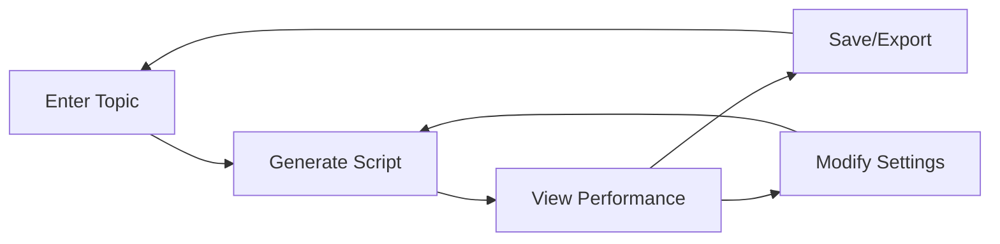

## User Journey Map

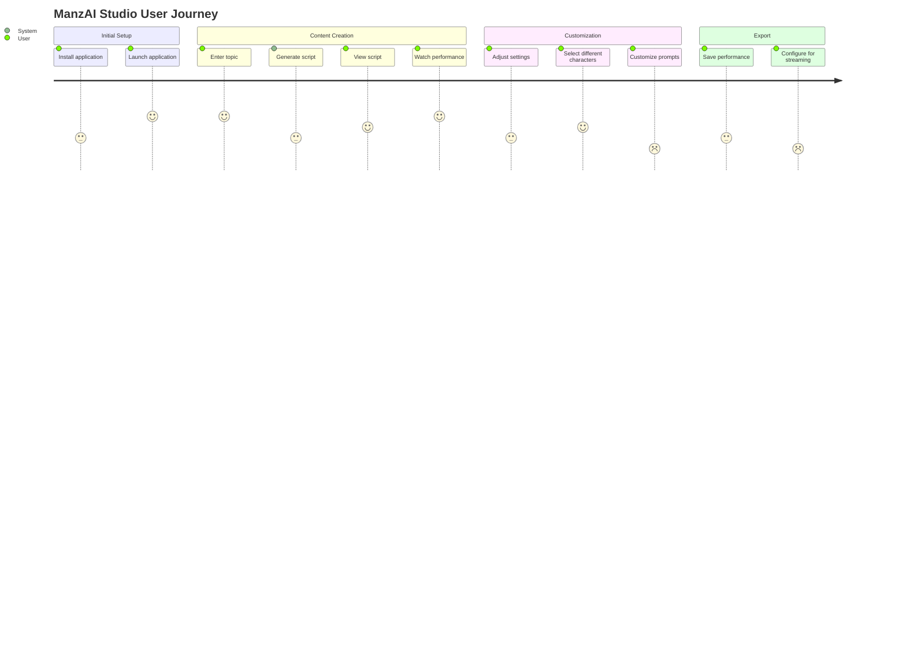

## Main Screens and Transitions

### Home Screen

The home screen is the main interface where users input topics and generate content.

**Elements:**
- Topic input field
- Generation button
- Character display area
- Settings menu access

**Actions:**
- Enter topic → Generate script
- Access settings → Navigate to Settings screen
- Select model → Model selection view

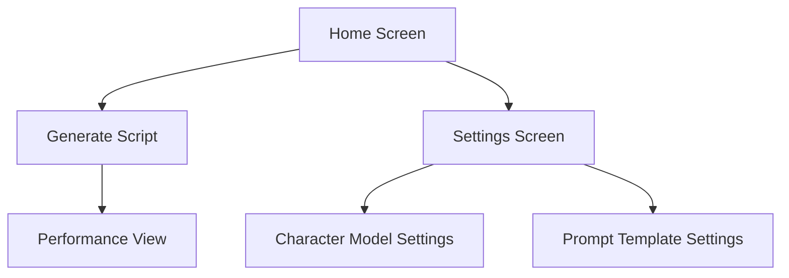

### Performance View

After script generation, the application shows the performance with animated characters and audio.

**Elements:**
- Live2D character displays
- Script text display
- Playback controls
- Settings access

**Actions:**
- Play/pause performance
- Restart performance
- Return to home for new generation
- Access display settings

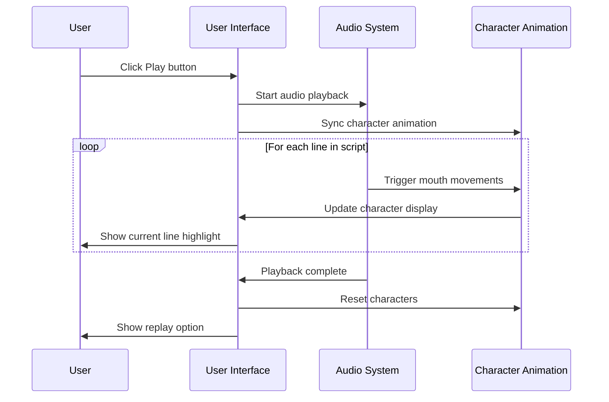

### Settings Screen

The settings screen allows users to customize the application behavior.

**Elements:**
- Character model selection
- Voice settings
- Prompt template management
- Display options

**Actions:**
- Select character models → Update character display
- Modify prompts → Save prompt template
- Adjust display settings → Update display configuration
- Return to home screen

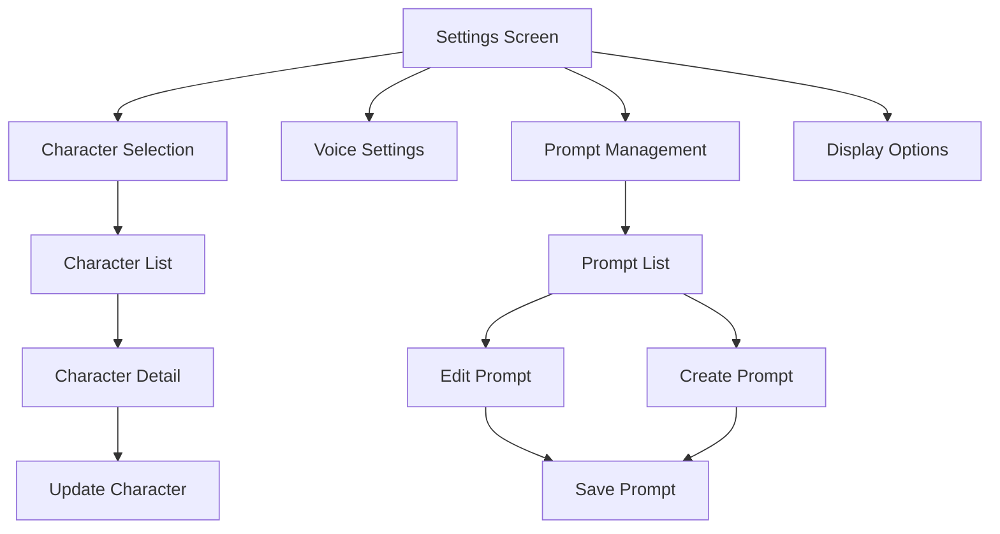

## Key User Scenarios

### Scenario 1: First-time User

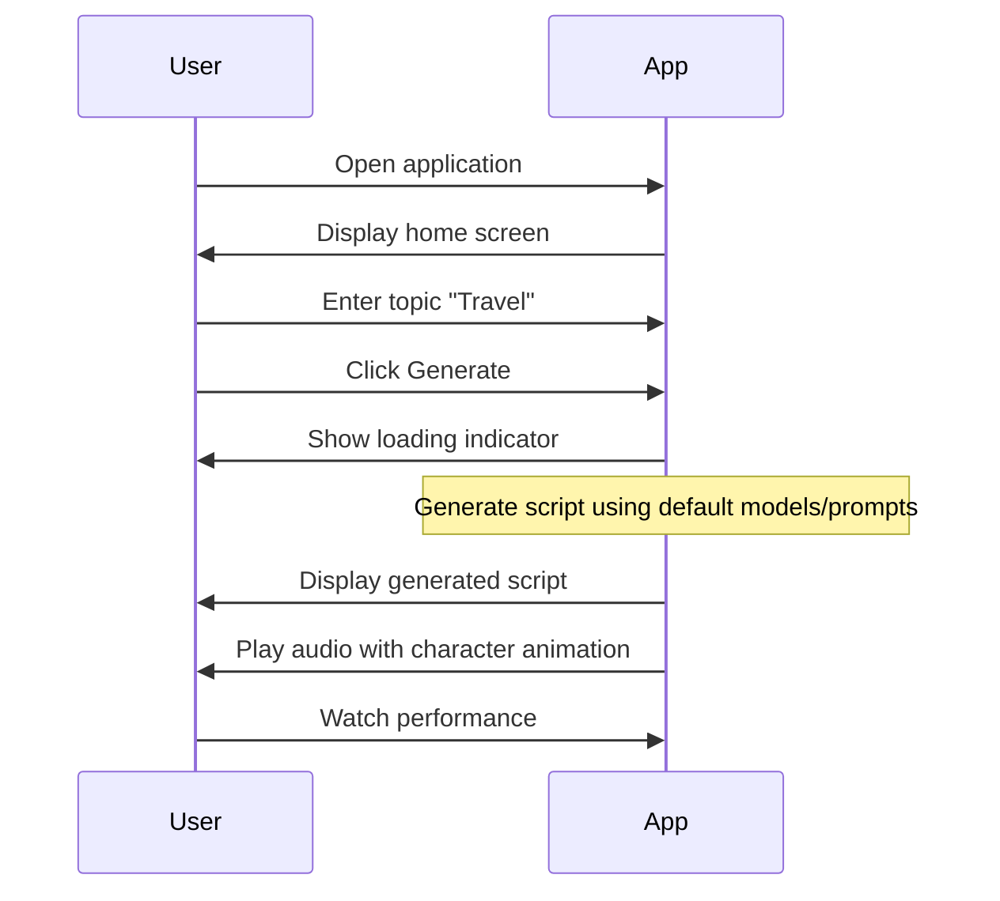

### Scenario 2: Customizing Characters

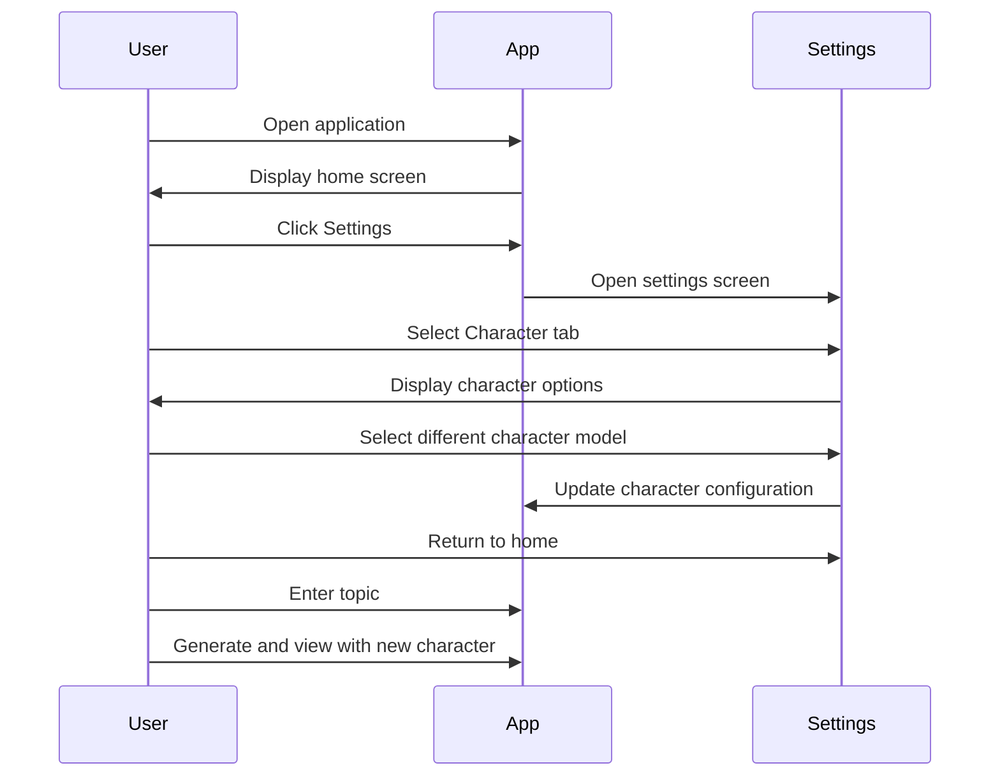

### Scenario 3: Creating Custom Prompt

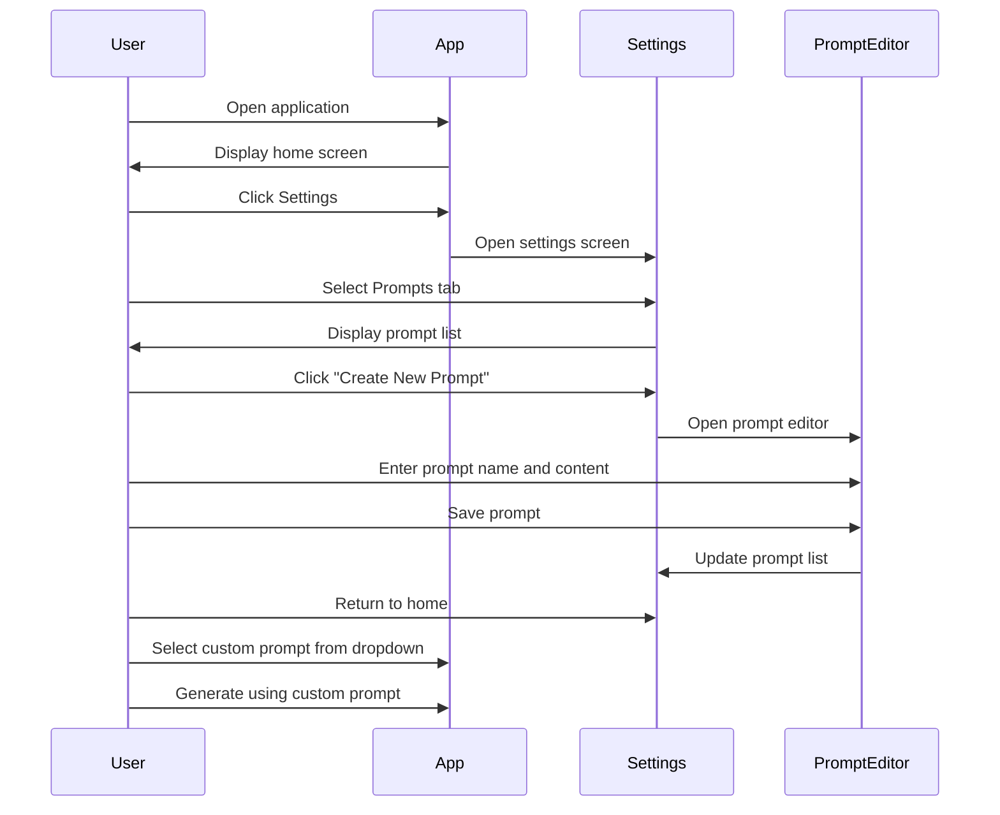

### Scenario 4: Streaming Setup

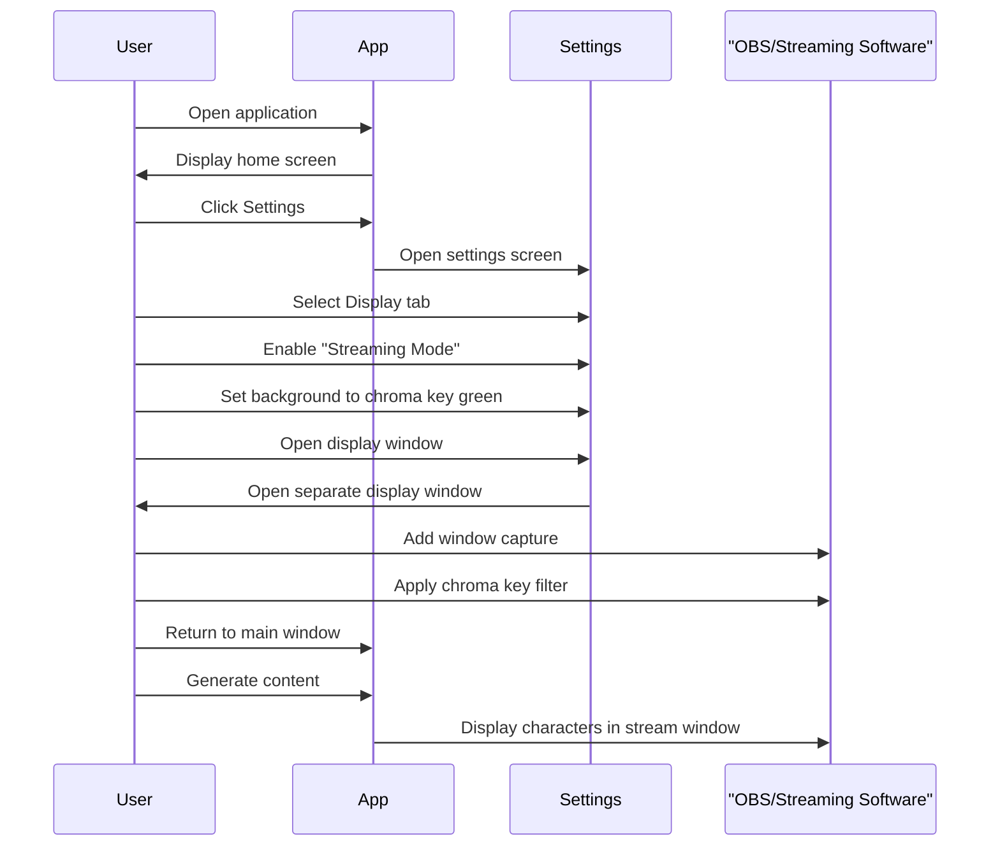

## Error Handling Flows

### Script Generation Error

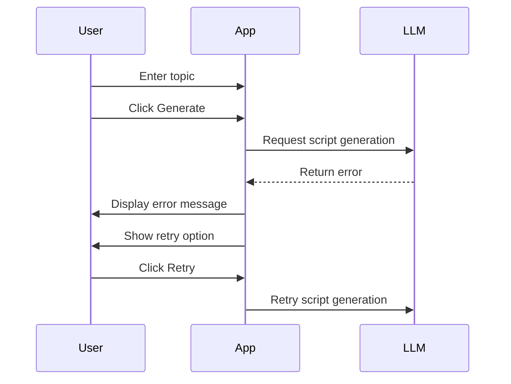

### Voice Synthesis Error

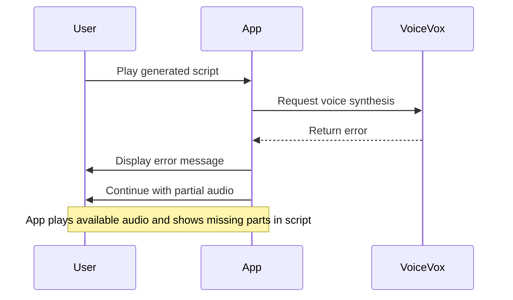

### Internet Connection Check

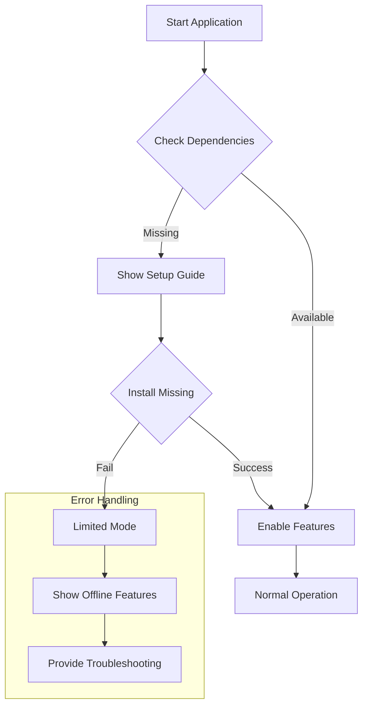

## Decision Points and Flow Control

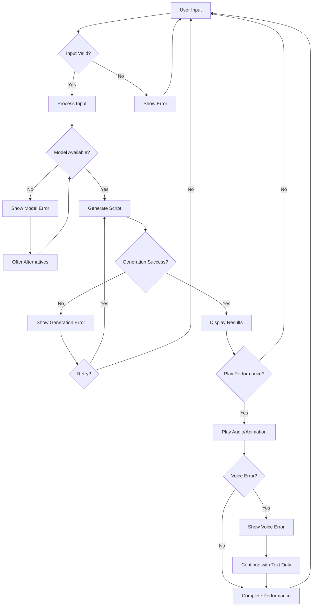

## Mobile Device Flow Differences

For mobile devices, the application flow is adjusted to accommodate smaller screens:

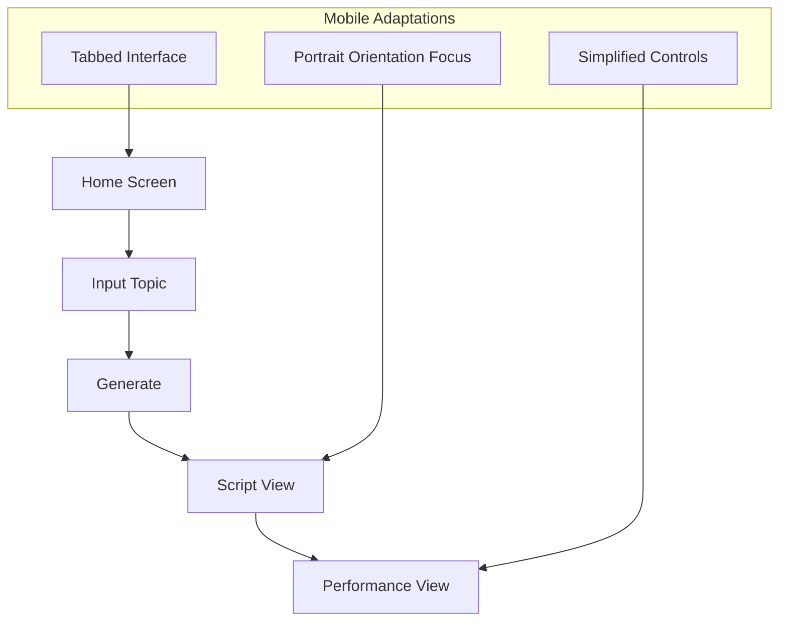

## User Preferences and Settings Flow

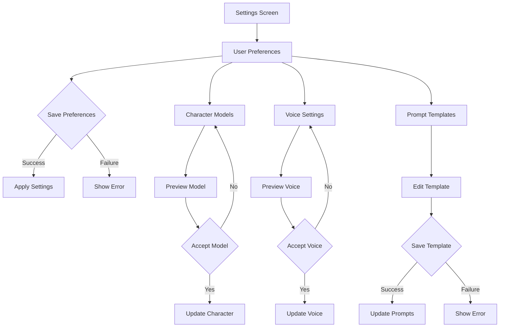

## Performance and Resource Management

The application monitors resource usage and adapts accordingly:

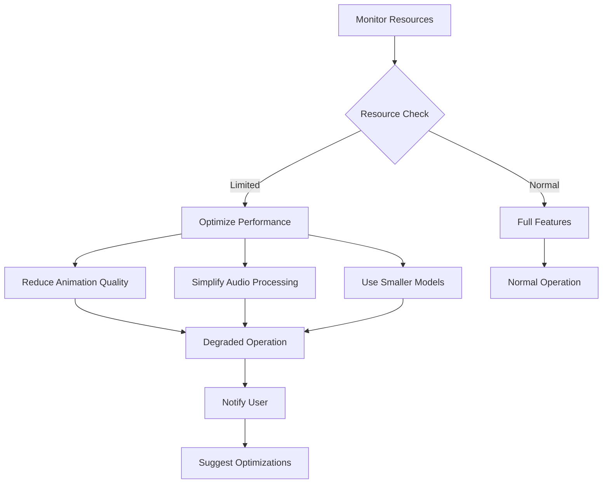

## Conclusion

This document provides a comprehensive overview of the user flows in ManzAI Studio. Understanding these flows helps in developing a cohesive and intuitive user experience. The application is designed to guide users through the process of creating, customizing, and enjoying AI-generated manzai performances, with appropriate error handling and adaptation to different usage scenarios.
