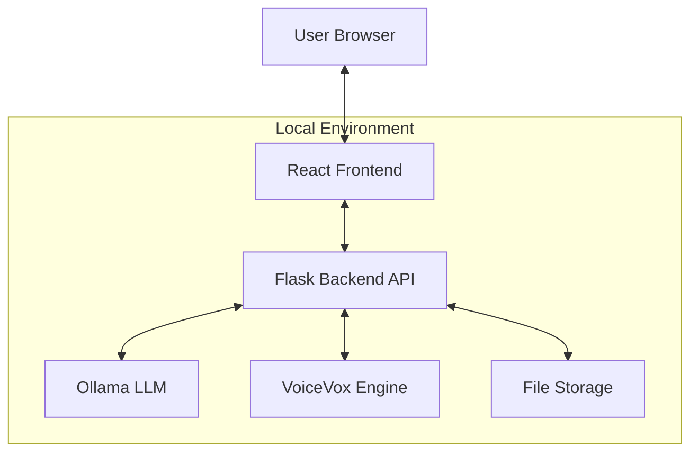
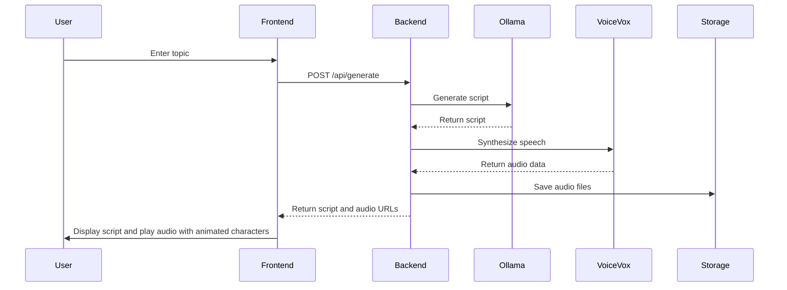
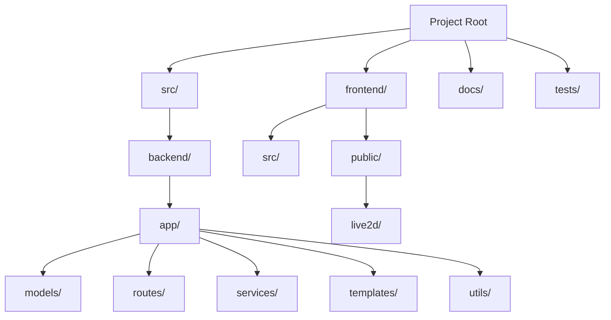

# ARCHITECTURE.md

# ManzAI Studio Architecture

This document provides a high-level overview of the ManzAI Studio architecture, explaining the core components and their interactions.

## System Architecture

## Core Components

### Frontend
- **React-based web interface** for user interactions
- **Live2D integration** for character animation
- **Audio playback** system synchronized with animations

### Backend
- **Flask API server** for handling requests
- **Service layer** for business logic
- **Utils** for helper functions and tools

### External Services
- **Ollama**: Local LLM server for script generation
- **VoiceVox**: Voice synthesis engine for converting text to natural-sounding speech

## Data Flow

## Technology Decisions

| Component | Technology | Rationale |
|-----------|------------|-----------|
| Frontend | React | Rich UI components, easy integration with Live2D SDK |
| Backend | Flask | Lightweight, Python compatibility with ML/AI tools |
| LLM | Ollama | Local execution, privacy, no API costs |
| Voice Synthesis | VoiceVox | High-quality Japanese TTS, character voices |
| Character Animation | Live2D | Industry standard for 2D character animation |

## Folder Structure

## Service Communication

All components run locally within the user's environment, communicating over HTTP:
- Frontend → Backend: HTTP requests to Flask API (localhost:5000)
- Backend → Ollama: HTTP requests to Ollama API (localhost:11434)
- Backend → VoiceVox: HTTP requests to VoiceVox API (localhost:50021)

This architecture ensures complete local operation without internet dependency after initial setup.

## Design Principles

1. **Local-First**: All processing happens on the user's machine, eliminating privacy concerns and internet dependency
2. **Modularity**: Separate services for different functionalities allows for easy component swapping
3. **Extensibility**: System designed to support additional character models and voice options

## Performance Considerations

- Ollama LLM inference can be resource-intensive, with recommended minimum 8GB RAM
- GPU acceleration can significantly improve LLM performance when available
- Audio synthesis is relatively lightweight and runs efficiently on CPU
- Live2D animation is optimized for browser rendering using WebGL

## Future Architecture Improvements

- Potential integration with additional LLM providers via pluggable interface
- Support for more voice synthesis engines beyond VoiceVox
- Consideration for WebGPU acceleration as browser support improves
- Possible offline package distribution for simpler installation
