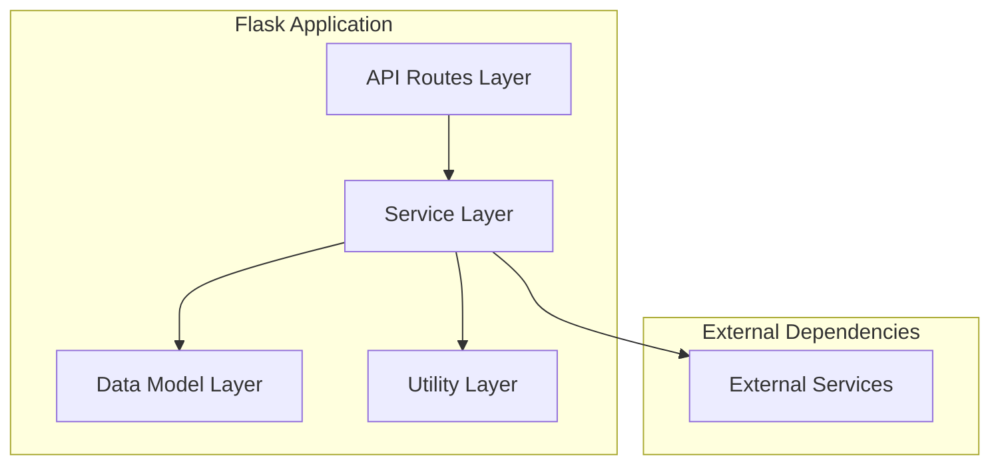
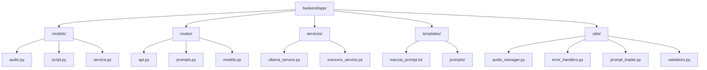
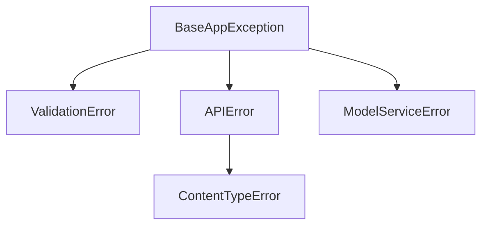
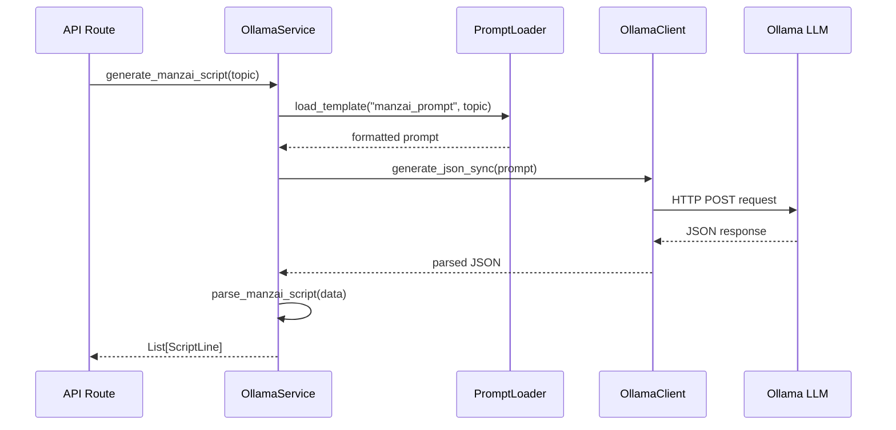
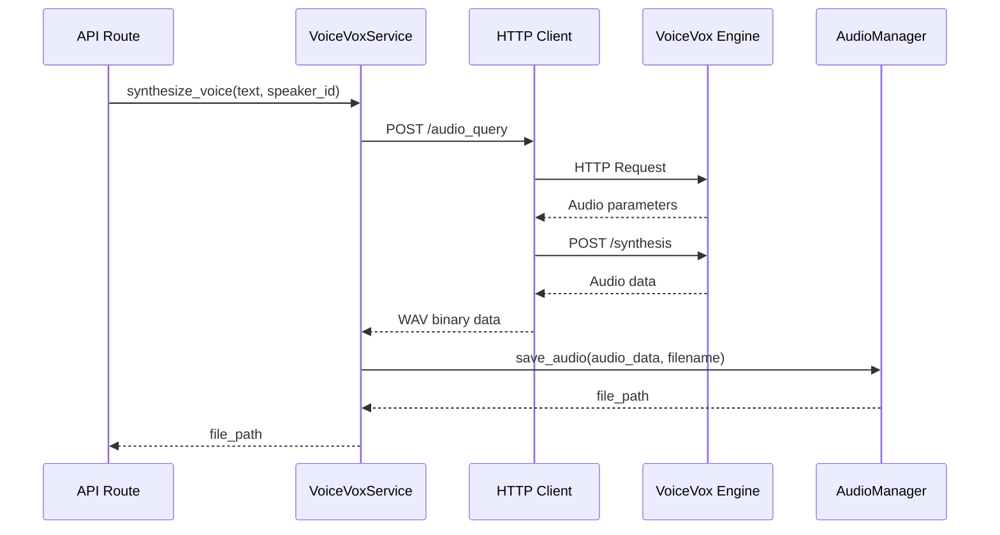

# BACKEND_GUIDE.md

# Backend Development Guide

This document provides an overview of the ManzAI Studio backend architecture, design patterns, and development guidelines.

## Architecture Overview

The backend is built using a layered architecture pattern:



### Layers and Responsibilities

1. **API Routes Layer**: Handles HTTP requests and responses
2. **Service Layer**: Contains business logic for script generation, audio synthesis, etc.
3. **Data Model Layer**: Defines data structures using Pydantic models
4. **External Services**: Interfaces with Ollama LLM and VoiceVox
5. **Utility Layer**: Provides helper functions and tools

## Key Design Patterns

### Service Pattern

The service pattern is used to encapsulate business logic:

```python
class OllamaService:
    """Service for interacting with Ollama LLM."""
    
    def __init__(self, base_url: str, instance_type: str = "auto"):
        # Initialize service
        
    def generate_manzai_script(self, topic: str, model_name: str = "gemma3:4b") -> List[ScriptLine]:
        """Generate a manzai script based on a topic."""
        # Implementation
```

### Factory Pattern

The application factory pattern is used to create and configure the Flask application:

```python
def create_app(config: Optional[Config] = None) -> Flask:
    """Create and configure the Flask application."""
    app = Flask(__name__)
    # Configuration and setup
    return app
```

### Repository Pattern

Used for data access and persistence:

```python
class PromptLoader:
    """Handles loading and managing prompt templates."""
    
    def get_all_prompts(self) -> List[Dict[str, Any]]:
        """Get all available prompts."""
        # Implementation
```

## Folder Structure



## Key Components and Files

### Model Definitions

Data models are defined using Pydantic in the `models/` directory:

```python
# models/script.py
from enum import Enum
from typing import List, Optional
from pydantic import BaseModel, Field, validator

class Role(str, Enum):
    """Manzai performer roles."""
    TSUKKOMI = "tsukkomi"
    BOKE = "boke"

class ScriptLine(BaseModel):
    """A line in a manzai script."""
    role: Role
    text: str
```

### API Routes

API endpoints are defined in the `routes/` directory:

```python
# routes/api.py
from flask import Blueprint, jsonify, request

bp = Blueprint("api", __name__, url_prefix="/api")

@bp.route("/generate", methods=["POST"])
def generate_manzai():
    """Generate a manzai script."""
    # Implementation
```

### Services

Business logic is implemented in the `services/` directory:

```python
# services/ollama_service.py
class OllamaService:
    """Service for interacting with the Ollama LLM API."""
    
    def generate_manzai_script(self, topic: str, model_name: str = "gemma3:4b") -> List[ScriptLine]:
        """Generate a manzai script based on a topic."""
        # Implementation
```

## Coding Standards

### Naming Conventions

- **Files**: Use snake_case for file names (e.g., `audio_manager.py`)
- **Classes**: Use PascalCase for class names (e.g., `OllamaService`)
- **Functions/Methods**: Use snake_case for function names (e.g., `generate_manzai_script`)
- **Variables**: Use snake_case for variable names (e.g., `audio_data`)
- **Constants**: Use UPPERCASE_WITH_UNDERSCORES (e.g., `DEFAULT_MODEL`)

### Type Hints

Use type hints for all function parameters and return values:

```python
def generate_manzai_script(topic: str, model_name: str = "gemma3:4b") -> List[ScriptLine]:
    """Generate a manzai script."""
    # Implementation
```

### Docstrings

Use Google-style docstrings:

```python
def function_name(param1: type, param2: type) -> return_type:
    """Short description.
    
    Longer description if needed.
    
    Args:
        param1: Description of param1
        param2: Description of param2
        
    Returns:
        Description of return value
        
    Raises:
        ExceptionType: When and why this exception is raised
    """
```

## Error Handling

ManzAI Studio uses a custom exception hierarchy for better error handling:



Use custom exception classes for domain-specific errors:

```python
class OllamaServiceError(Exception):
    """Error occurred in Ollama service."""
    pass

# Usage
if not response.ok:
    raise OllamaServiceError(f"Failed to generate script: {response.status_code}")
```

API error handlers are defined in `utils/error_handlers.py`:

```python
@api_error_handler
def view_function():
    # Implementation that might raise exceptions
```

## API Integration

### Ollama Integration

Ollama integration is handled through the OllamaService:

```python
# Create client
client = OllamaClient(base_url="http://localhost:11434")

# Generate text
response = client.generate_text_sync(
    prompt="Generate a manzai about...",
    model_name="gemma3:4b",
    options={"temperature": 0.7}
)
```

### VoiceVox Integration

VoiceVox integration is handled through the VoiceVoxService:

```python
# Create client
client = VoiceVoxService(base_url="http://localhost:50021")

# Generate voice
audio_data = client.generate_voice("こんにちは", speaker_id=1)
```

## Testing

The backend uses pytest for testing:

```python
def test_generate_manzai_script_success(mock_generate, ollama_service):
    """Test successful manzai script generation."""
    ollama_service.prompt_loader.load_template.return_value = "test prompt"
    mock_generate.return_value = {
        "script": [
            {"speaker": "A", "text": "こんにちは"},
            {"speaker": "B", "text": "どうも"}
        ]
    }
    
    result = ollama_service.generate_manzai_script("テスト")
    assert len(result) == 2
    assert isinstance(result[0], ScriptLine)
    assert result[0].role == Role.TSUKKOMI
    assert result[0].text == "こんにちは"
```

Run tests with:

```bash
poetry run test
# or
poetry run pytest
```

## Dependency Management

Dependencies are managed using Poetry and defined in `pyproject.toml`:

```toml
[tool.poetry.dependencies]
python = "^3.10"
flask = "^3.0.2"
flask-cors = "^4.0.0"
requests = "^2.31.0"
pydantic = "^2.10.6"
# ...

[tool.poetry.group.dev.dependencies]
pytest = "^8.0.2"
pytest-cov = "^4.1.0"
black = "^24.2.0"
flake8 = "^7.0.0"
mypy = "^1.8.0"
# ...
```

Add a new dependency:

```bash
poetry add package-name
```

Add a development dependency:

```bash
poetry add --group dev package-name
```

## Prompt Management

Prompts are managed through the `PromptLoader` class:

```python
# Load a prompt template and fill in variables
prompt = prompt_loader.load_template("manzai_prompt", topic="AI")
```

Prompt templates are stored in the `templates/` directory:

- Plain text templates: `templates/*.txt`
- JSON templates: `templates/prompts/*.json`

## Script Generation

The script generation flow:



## Voice Synthesis

The voice synthesis flow:



## Configuration Management

Configuration is managed through the `Config` classes in `config.py`:

```python
class BaseConfig(BaseModel):
    """Base configuration model."""
    
    TESTING: bool = Field(False, description="Test mode flag")
    VOICEVOX_URL: str = Field(
        default_factory=lambda: os.getenv("VOICEVOX_URL", "http://localhost:50021"),
        description="VoiceVox API URL"
    )
    # More configuration parameters...
```

Environment-specific configurations:
- `DevelopmentConfig`: Development environment settings
- `TestConfig`: Test environment settings
- `ProductionConfig`: Production environment settings

## Logging

Logging is configured in the application initialization:

```python
logging.basicConfig(
    level=logging.INFO,
    format='%(asctime)s - %(name)s - %(levelname)s - %(message)s'
)
logger = logging.getLogger(__name__)

# Usage
logger.info("Starting application")
logger.warning("Potential issue detected")
logger.error("Error occurred")
```

## Security Considerations

- Input validation with Pydantic models
- Content type validation with custom middleware
- File path sanitization to prevent path traversal
- Error messages with appropriate detail levels
- File size limits for uploaded content

## Best Practices

1. **Separation of Concerns**: Keep layers separate with clear responsibilities
2. **Explicit Error Handling**: Use custom exceptions and proper error propagation
3. **Type Safety**: Use type hints and Pydantic models
4. **Documentation**: Document classes, methods, and complex logic
5. **Testing**: Write unit tests for business logic
6. **Configuration**: Use environment variables and configuration objects
7. **Performance**: Consider resource usage, especially for LLM operations
8. **Consistency**: Follow naming conventions and code style guidelines

Following these guidelines will help create maintainable and robust backend code for ManzAI Studio.