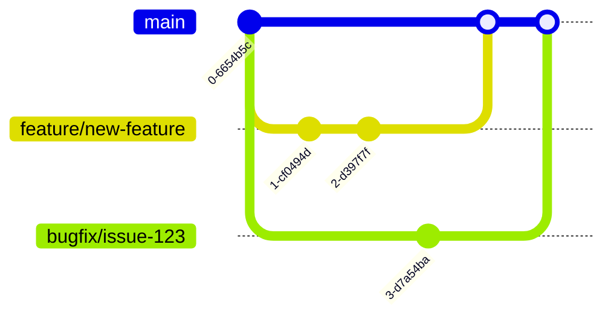

# CONTRIBUTING.md

# Contributing to ManzAI Studio

Thank you for your interest in contributing to ManzAI Studio! This document outlines the process for contributing to the project and guidelines to follow.

## Code of Conduct

Please follow these basic principles when contributing:
- Be respectful and inclusive
- Provide constructive feedback
- Focus on what is best for the community

## Branch Strategy

We follow a simplified GitHub Flow model:



- `main` - Always stable and deployable
- `feature/*` - For new features
- `bugfix/*` - For bug fixes
- `docs/*` - For documentation changes

## Development Workflow

1. Fork the repository
2. Create a feature/bugfix branch
3. Make your changes
4. Run tests to ensure everything works
5. Submit a pull request

## Pull Request Process


1. Ensure your PR includes only relevant changes
2. Update documentation if necessary
3. Add tests for new functionality
4. Make sure existing tests pass
5. Get at least one code review approval before merging

## Coding Conventions

### Python

- Follow PEP 8 style guide
- Use type hints
- Use descriptive variable names
- Write docstrings in Google style

```python
def function_name(param1: str, param2: int) -> bool:
    """Short description of function.

    Args:
        param1: Description of param1
        param2: Description of param2

    Returns:
        Description of return value
    """
    # Function implementation
```

### JavaScript/React

- Use ES6+ features
- Prefer functional components
- Use descriptive variable and function names
- Add comments for complex logic

```javascript
// Good component example
const ComponentName = ({ prop1, prop2 }) => {
  const [state, setState] = useState(initialValue);

  // Handle some action
  const handleAction = () => {
    // Implementation
  };

  return (
    <div className="component-name">
      {/* Component rendering */}
    </div>
  );
};
```

## Testing

- Write unit tests for all new functionality
- Ensure existing tests pass before submitting PR
- Run tests with `poetry run test`

## Documentation

Update relevant documentation when:
- Adding new features
- Changing existing functionality
- Fixing bugs that affect user experience

## Commit Messages

Use conventional commit messages to make the history more readable:

```
feat: Add new character model selection feature
fix: Correct audio synchronization issue
docs: Update installation instructions
test: Add test for script generation
refactor: Improve prompt loading mechanism
```

## Issue Tracking

- Check existing issues before creating a new one
- Use issue templates where available
- Be specific about the problem or feature
- Include steps to reproduce for bugs
- Provide context and use cases for feature requests

## Development Environment Setup

Follow the [Development Setup Guide](docs/DEVELOPMENT_SETUP.md) to set up your local environment.

## Code Review Guidelines

When reviewing code:
- Focus on correctness, readability, and maintainability
- Be constructive and respectful
- Consider performance impacts
- Verify test coverage
- Check documentation updates

When receiving reviews:
- Thank reviewers for their time
- Address all comments
- Explain your reasoning when disagreeing
- Make requested changes promptly

## Project Communication

- Use GitHub issues for bug reports and feature discussions
- Use pull requests for code-related discussions
- Join our community chat for quick questions

## Questions?

If you have any questions about contributing, please open an issue with the tag "question".

We appreciate your contributions to making ManzAI Studio better!
