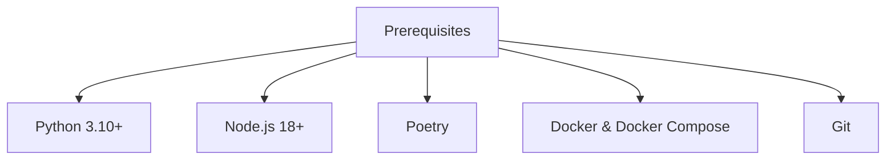
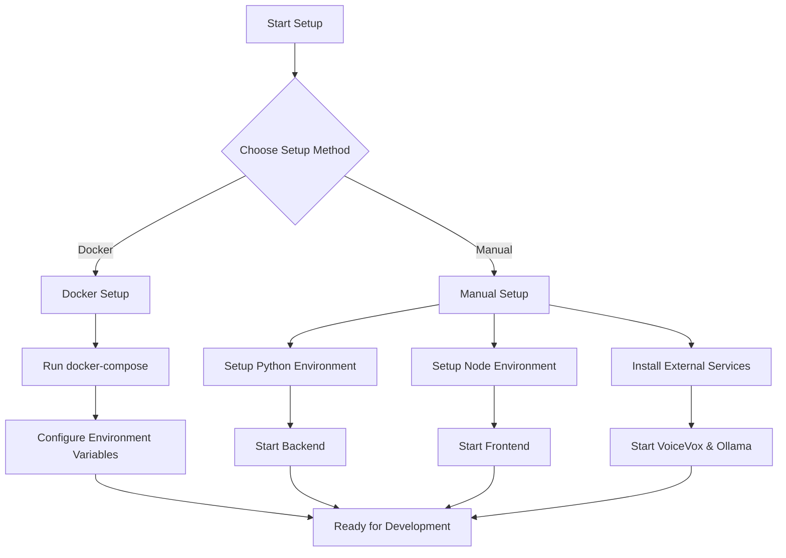
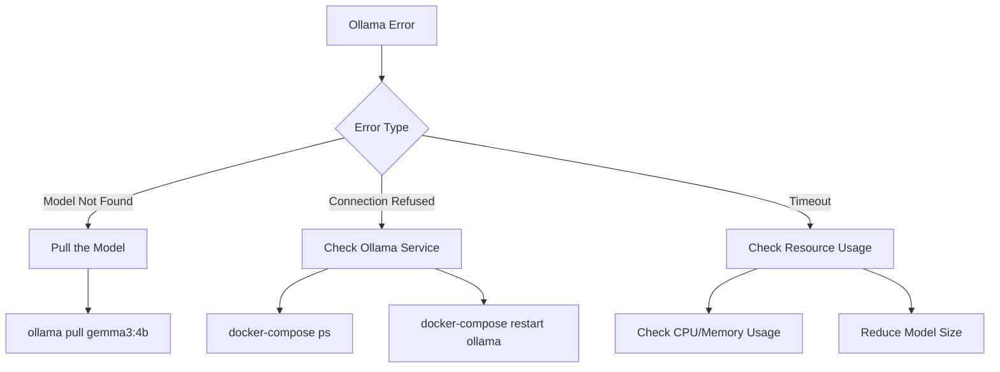

# DEVELOPMENT_SETUP.md

# Development Setup Guide

This guide provides detailed instructions for setting up the ManzAI Studio development environment.

## Prerequisites

Before starting, ensure you have the following installed:



- **Python 3.10+**: Required for backend development
- **Node.js 18+**: Required for frontend development
- **Poetry**: Python dependency management
- **Docker & Docker Compose**: For containerized development environment
- **Git**: Version control

## Environment Setup Flow



## Docker Setup (Recommended)

The easiest way to set up the development environment is using Docker:

```bash
# Clone the repository
git clone https://github.com/yourusername/manzai-studio.git
cd manzai-studio

# Start development environment
docker-compose -f docker-compose.dev.yml up -d
```

This will start:
- Flask backend server (http://localhost:5000)
- React development server (http://localhost:3000)
- VoiceVox engine (http://localhost:50021)
- Ollama LLM service (http://localhost:11434)

### Environment Variables

The default environment variables are defined in the `docker-compose.dev.yml` file:

```yaml
environment:
  - FLASK_APP=src.app:create_app
  - FLASK_ENV=development
  - FLASK_DEBUG=1
  - VOICEVOX_URL=http://voicevox:50021
  - OLLAMA_URL=http://ollama:11434
  - OLLAMA_MODEL=gemma3:4b
```

You can override these by creating a `.env` file in the project root.

### Downloading Required Models

After starting the Docker environment, you need to pull the required LLM model:

```bash
# Access Ollama container
docker exec -it manzai-studio_ollama_1 /bin/bash

# Pull the model
ollama pull gemma3:4b
```

## Manual Setup

If you prefer to set up services manually:

### Python Backend Setup

```bash
# Install Python 3.10 (using pyenv)
pyenv install 3.10.13
pyenv local 3.10.13

# Install Poetry
curl -sSL https://install.python-poetry.org | python3 -

# Install dependencies
poetry install

# Run backend server
poetry run start
```

### Frontend Setup

```bash
# Navigate to frontend directory
cd frontend

# Install dependencies
npm install

# Start development server
npm run dev
```

### External Services Setup

#### VoiceVox

1. Download VoiceVox from [the official website](https://voicevox.hiroshiba.jp/)
2. Install and run the application
3. Ensure it's running on port 50021

#### Ollama

1. Install Ollama from [ollama.ai](https://ollama.ai)
2. Pull required models:
```bash
ollama pull gemma3:4b
```

## Configuration

### Environment Variables

Create a `.env` file in the project root:

```
FLASK_APP=src.app:create_app
FLASK_ENV=development
FLASK_DEBUG=1
VOICEVOX_URL=http://localhost:50021
OLLAMA_URL=http://localhost:11434
OLLAMA_MODEL=gemma3:4b
```

## Project Structure

```
manzai_studio/
├── src/
│   ├── backend/
│   │   ├── app/
│   │   │   ├── models/       # Data models
│   │   │   ├── routes/       # API endpoints
│   │   │   ├── services/     # Business logic
│   │   │   ├── templates/    # Prompt templates
│   │   │   └── utils/        # Utility functions
│   ├── app.py                # Application entry point
├── frontend/
│   ├── src/                  # React components
│   ├── public/               # Static assets
├── tests/                    # Test suite
├── docs/                     # Documentation
└── docker-compose.yml        # Docker configuration
```

## Development Tools

### Backend Development

Poetry commands for backend development:

```bash
# Start the backend server
poetry run start

# Run tests
poetry run test

# Run tests with coverage
poetry run coverage

# Run linting
poetry run lint

# Format code
poetry run format

# Check types
poetry run type-check
```

### Frontend Development

NPM commands for frontend development:

```bash
# Start the development server
npm run dev

# Build for production
npm run build

# Run tests
npm run test

# Run tests in watch mode
npm run test:watch
```

## Common Issues and Solutions

### VoiceVox Connection Issues

**Problem**: Backend can't connect to VoiceVox

**Solution**: 
```bash
# Check if VoiceVox is running
curl http://localhost:50021/version

# If needed, restart VoiceVox or update the URL in .env
```

### Ollama Model Issues

**Problem**: Missing LLM models

**Solution**:
```bash
# List available models
ollama list

# Pull required model if missing
ollama pull gemma3:4b
```



### Python Version Issues

**Problem**: ModuleNotFoundError or SyntaxError

**Solution**: Ensure you're using Python 3.10+ and your Poetry environment is activated:
```bash
python --version  # Should be 3.10+
poetry env info   # Check Poetry environment
```

### React Development Server Issues

**Problem**: Frontend development server won't start

**Solution**:
```bash
# Check for port conflicts
lsof -i :3000
# Kill conflicting process if needed
kill -9 <PID>

# Reinstall dependencies if needed
rm -rf node_modules
npm install
```

## Live2D Model Setup

To add custom Live2D models:

1. Create a new directory in `frontend/public/live2d/models/<model_name>/`
2. Add model files (.model3.json, textures, etc.)
3. Create a `model.json` metadata file:
   ```json
   {
     "name": "Model Name",
     "type": "tsukkomi",  // or "boke" or "unknown"
     "model": "model_file.model3.json",
     "textures": ["texture.png"],
     "version": "1.0.0"
   }
   ```
4. Add a thumbnail image as `thumbnail.png` (recommended)

You can use the provided script to generate the metadata file:
```bash
node scripts/create_model_metadata.js
```

## Testing

### Backend Testing

```bash
# Run all tests
poetry run test

# Run specific test file
poetry run pytest tests/path/to/test_file.py

# Run with coverage
poetry run coverage
```

### Frontend Testing

```bash
# Run all tests
npm run test

# Run specific test file
npm run test -- src/components/MyComponent.test.js

# Run tests in watch mode
npm run test:watch
```

## Debugging

### Backend Debugging

Use the Flask debug mode (enabled by default in development).

You can also use Python's debugger:
```python
import pdb; pdb.set_trace()
```

### Frontend Debugging

Use your browser's developer tools for debugging React components.

For specific component debugging, you can use the React Developer Tools browser extension.

## Next Steps

After setting up your development environment, you may want to:

1. Familiarize yourself with the [ARCHITECTURE.md](ARCHITECTURE.md) document
2. Review the [API_DOCUMENTATION.md](API_DOCUMENTATION.md) for API details
3. Check the [CONTRIBUTING.md](CONTRIBUTING.md) for contribution guidelines

Happy coding!