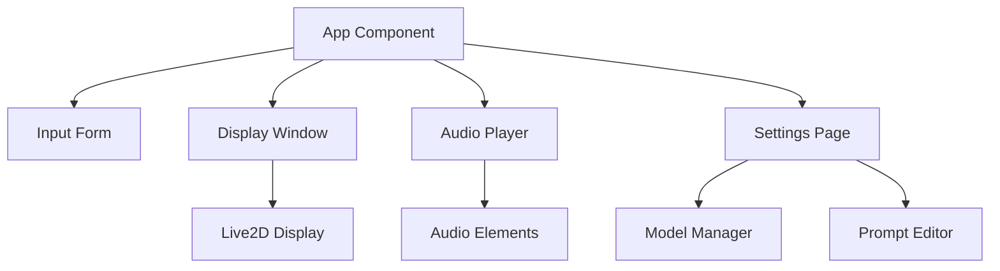
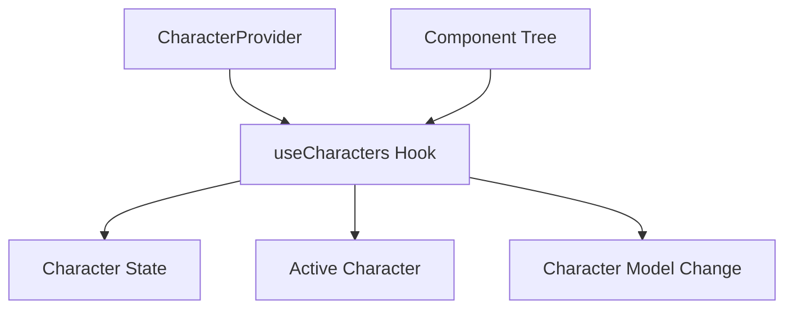
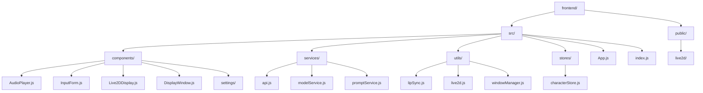
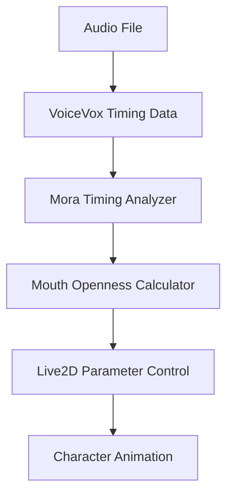

# FRONTEND_GUIDE.md

# Frontend Development Guide

This document provides an overview of the ManzAI Studio frontend architecture, design patterns, and development guidelines.

## Architecture Overview

The frontend is built using React and follows a component-based architecture:



## State Management

The frontend uses React context and hooks for state management:



## Key Components

### App Component

Main application component that coordinates other components:

```jsx
const App = () => {
  const [script, setScript] = useState(null);
  const [isPlaying, setIsPlaying] = useState(false);
  const [currentAudioIndex, setCurrentAudioIndex] = useState(-1);
  const [mouthOpenValue, setMouthOpenValue] = useState(0);

  // Component logic

  return (
    <CharacterProvider>
      <div className="app-container">
        <header className="app-header">
          <h1>ManzAI Studio</h1>
        </header>

        <main className="app-main">
          <InputForm onSubmit={handleGenerateScript} isGenerating={isGenerating} />

          {script && (
            <>
              <section className="display-section">
                <DisplayWindow
                  isPlaying={isPlaying}
                  mouthOpenValue={mouthOpenValue}
                />
              </section>

              <section className="script-section">
                <AudioPlayer
                  audioData={audioData}
                  onPlayStateChange={handlePlayStateChange}
                />
              </section>
            </>
          )}
        </main>
      </div>
    </CharacterProvider>
  );
};
```

### Input Form

Handles user input for script generation:

```jsx
const InputForm = ({ onSubmit, isGenerating }) => {
  const [topic, setTopic] = useState('');
  const [error, setError] = useState('');

  const handleSubmit = (e) => {
    e.preventDefault();

    if (!topic.trim()) {
      setError('トピックを入力してください');
      return;
    }

    setError('');
    onSubmit(topic);
  };

  return (
    <form onSubmit={handleSubmit} className="input-form">
      <div className="form-group">
        <input
          type="text"
          value={topic}
          onChange={(e) => setTopic(e.target.value)}
          placeholder="トピックを入力"
          disabled={isGenerating}
          className="form-control"
        />
        {error && <div className="error-message">{error}</div>}
      </div>
      <button
        type="submit"
        disabled={isGenerating}
        className="submit-button"
      >
        {isGenerating ? '生成中...' : '生成'}
      </button>
    </form>
  );
};
```

### Live2D Integration

Components for rendering Live2D character models:

```jsx
const Live2DDisplay = ({ modelPath, isPlaying, mouthOpenValue }) => {
  const canvasRef = useRef(null);
  const modelLoadedRef = useRef(false);

  // Load Live2D model
  useEffect(() => {
    const loadLive2DModel = async () => {
      if (canvasRef.current) {
        try {
          await loadModel(modelPath, canvasRef.current);
          modelLoadedRef.current = true;
        } catch (error) {
          console.error('Failed to load Live2D model:', error);
        }
      }
    };

    loadLive2DModel();

    // Cleanup
    return () => {
      releaseModel();
      modelLoadedRef.current = false;
    };
  }, [modelPath]);

  // Update mouth parameter
  useEffect(() => {
    if (modelLoadedRef.current) {
      setParameter("ParamMouthOpenY", mouthOpenValue);
    }
  }, [isPlaying, mouthOpenValue]);

  return (
    <canvas
      ref={canvasRef}
      width="800"
      height="600"
      style={{ width: '100%', height: '100%' }}
    />
  );
};
```

### Audio Player

Manages audio playback for the generated script:

```jsx
const AudioPlayer = ({ audioData, onPlayStateChange }) => {
  const [isPlaying, setIsPlaying] = useState(false);
  const [currentIndex, setCurrentIndex] = useState(-1);
  const audioRefs = useRef([]);

  // Play audio sequentially
  const playAudio = async (index) => {
    if (index >= audioData.length) {
      // Playback complete
      setIsPlaying(false);
      setCurrentIndex(-1);
      onPlayStateChange(false, null, -1);
      return;
    }

    const audio = audioRefs.current[index];
    if (!audio) return;

    setCurrentIndex(index);
    setIsPlaying(true);
    onPlayStateChange(true, audio, index);

    audio.currentTime = 0;
    await audio.play();

    // Play next audio when this one finishes
    audio.onended = () => {
      playAudio(index + 1);
    };
  };

  // Handle play/stop button click
  const handlePlayToggle = () => {
    if (isPlaying) {
      // Stop playback
      audioRefs.current.forEach(audio => {
        if (audio) {
          audio.pause();
          audio.currentTime = 0;
        }
      });

      setIsPlaying(false);
      setCurrentIndex(-1);
      onPlayStateChange(false, null, -1);
    } else {
      // Start playback
      playAudio(0);
    }
  };

  return (
    <div className="audio-player">
      {/* Hidden audio elements */}
      {audioData.map((audio, index) => (
        <audio
          key={index}
          ref={el => audioRefs.current[index] = el}
          src={audio.audio_path}
          preload="auto"
        />
      ))}

      {/* Play/Stop button */}
      <button onClick={handlePlayToggle}>
        {isPlaying ? '停止' : '再生'}
      </button>
    </div>
  );
};
```

## Project Structure



## Key Files and Their Purpose

### Components

- **App.js**: Main application component and layout
- **InputForm.js**: Form for entering topics and generating scripts
- **AudioPlayer.js**: Audio playback controls and synchronization
- **Live2DDisplay.js**: Live2D model rendering and animation
- **DisplayWindow.js**: Character display container and management
- **settings/ModelManager.js**: Character model selection and management
- **settings/PromptEditor.js**: Prompt template editing and management
- **settings/SettingsPage.js**: Settings page layout and tab navigation

### Services

- **api.js**: Backend API communication functions
- **modelService.js**: Live2D model management functions
- **promptService.js**: Prompt template management functions

### Utils

- **lipSync.js**: Lip synchronization algorithms
- **live2d.js**: Live2D SDK interface and management
- **windowManager.js**: Window management for display mode

### Stores

- **characterStore.js**: Character state management using Context API

## Lip Synchronization

The lip sync system maps voice audio timing data to character mouth movements:



The main lip sync algorithm:

```javascript
export const calculateMouthOpenness = (timingData, currentTime) => {
  // Find the current mora (syllable) being spoken
  for (const phrase of timingData.accent_phrases) {
    for (const mora of phrase.moras) {
      if (currentTime >= mora.start_time && currentTime <= mora.end_time) {
        // Calculate openness based on vowel type
        const openness = calculateMoraOpenness(mora.text);

        // Animate using sine wave for natural movement
        const position = (currentTime - mora.start_time) / (mora.end_time - mora.start_time);
        return openness * Math.sin(position * Math.PI);
      }
    }
  }

  return 0;  // Mouth closed when not speaking
};
```

## Live2D Integration

The Live2D integration uses the Live2D Cubism SDK:

```javascript
export const loadModel = async (modelPath, canvasElement) => {
  if (!canvasElement) {
    console.error('Canvas element is not provided');
    return;
  }

  // Cancel any previous animation
  if (frameId) {
    cancelAnimationFrame(frameId);
    frameId = null;
  }

  // Set up WebGL context
  canvas = canvasElement;
  gl = canvas.getContext('webgl') || canvas.getContext('experimental-webgl');

  if (!gl) {
    console.error('WebGL is not supported in this browser');
    return;
  }

  try {
    // Load model (implementation depends on Live2D SDK)
    // ...

    // Start animation
    startAnimation();

    return live2dModel;
  } catch (error) {
    console.error('Failed to load Live2D model:', error);
    return null;
  }
};
```

## State Management

Character state is managed using React Context:

```javascript
export const CharacterProvider = ({ children }) => {
  const [characters, setCharacters] = useState(DEFAULT_CHARACTERS);
  const [activeCharacter, setActiveCharacter] = useState('tsukkomi');

  // Change character model
  const changeCharacterModel = (character, modelId) => {
    // Implementation
  };

  // Switch active character
  const switchActiveCharacter = (character) => {
    setActiveCharacter(character);
  };

  return (
    <CharacterContext.Provider value={{
      characters,
      activeCharacter,
      changeCharacterModel,
      switchActiveCharacter
    }}>
      {children}
    </CharacterContext.Provider>
  );
};

export const useCharacters = () => {
  const context = useContext(CharacterContext);
  if (!context) {
    throw new Error('useCharacters must be used within a CharacterProvider');
  }
  return context;
};
```

## API Communication

The frontend communicates with the backend API using fetch:

```javascript
export const generateManzaiScript = async (topic, useMock = false) => {
  try {
    const response = await fetch('/api/generate', {
      method: 'POST',
      headers: {
        'Content-Type': 'application/json',
      },
      body: JSON.stringify({
        topic,
        use_mock: useMock
      }),
    });

    if (!response.ok) {
      throw new Error(`API error: ${response.status}`);
    }

    return await response.json();
  } catch (error) {
    console.error('Error generating manzai script:', error);
    throw error;
  }
};
```

## Coding Standards

### Component Structure

Follow this structure for React components:

```jsx
// Import statements
import React, { useState, useEffect, useRef } from 'react';
import PropTypes from 'prop-types';

/**
 * Component description
 */
const ComponentName = ({ prop1, prop2 }) => {
  // State hooks
  const [state, setState] = useState(initialValue);

  // Refs
  const ref = useRef(null);

  // Effects
  useEffect(() => {
    // Side effect logic
    return () => {
      // Cleanup logic
    };
  }, [dependencies]);

  // Event handlers
  const handleEvent = () => {
    // Event handling logic
  };

  // Render
  return (
    <div className="component-name">
      {/* Component content */}
    </div>
  );
};

// PropTypes
ComponentName.propTypes = {
  prop1: PropTypes.string.isRequired,
  prop2: PropTypes.number
};

export default ComponentName;
```

### CSS Naming

Use BEM-inspired naming for CSS classes:

```css
/* Block */
.component-name {
  /* Styles */
}

/* Element */
.component-name__element {
  /* Styles */
}

/* Modifier */
.component-name--modifier {
  /* Styles */
}
```

### File Organization

- One component per file
- Name files after the component they contain
- Group related components in subdirectories
- Keep utilities in separate files by functionality

### Testing

Write tests for components using React Testing Library:

```javascript
import { render, screen, fireEvent } from '@testing-library/react';
import InputForm from './InputForm';

describe('InputForm', () => {
  test('calls onSubmit with topic when form is submitted', () => {
    const handleSubmit = jest.fn();
    render(<InputForm onSubmit={handleSubmit} />);

    const input = screen.getByPlaceholderText(/トピックを入力/i);
    const submitButton = screen.getByRole('button', { name: /生成/i });

    fireEvent.change(input, { target: { value: 'テスト' } });
    fireEvent.click(submitButton);

    expect(handleSubmit).toHaveBeenCalledWith('テスト');
  });
});
```

## Performance Optimization

### Optimizing Renders

Use React's memoization features to prevent unnecessary re-renders:

```jsx
// Memoize a component
const MemoizedComponent = React.memo(MyComponent);

// Memoize a callback
const memoizedCallback = useCallback(() => {
  doSomething(a, b);
}, [a, b]);

// Memoize a computed value
const memoizedValue = useMemo(() => {
  return computeExpensiveValue(a, b);
}, [a, b]);
```

### Live2D Performance

Optimize Live2D rendering:

- Adjust canvas size based on viewport
- Reduce animation complexity when not in focus
- Use requestAnimationFrame for smooth animations
- Implement visibility detection to pause rendering when not visible

## Accessibility

Implement basic accessibility features:

- Use semantic HTML elements
- Include proper alt text for images
- Ensure keyboard navigation works
- Maintain sufficient color contrast
- Add ARIA attributes where needed

Example:

```jsx
<button
  onClick={handlePlayToggle}
  aria-label={isPlaying ? '停止' : '再生'}
  aria-pressed={isPlaying}
>
  {isPlaying ? '停止' : '再生'}
</button>
```

## Responsive Design

The UI is designed to work on different screen sizes:

```css
/* Mobile-first approach */
.component {
  /* Base styles for all devices */
}

/* Tablet and larger */
@media (min-width: 768px) {
  .component {
    /* Styles for tablets */
  }
}

/* Desktop */
@media (min-width: 1024px) {
  .component {
    /* Styles for desktop */
  }
}
```

## Error Handling

Handle errors gracefully:

```jsx
const [error, setError] = useState(null);

const handleGenerateScript = async () => {
  try {
    setIsGenerating(true);
    setError(null);

    const data = await generateManzaiScript(topic);
    setScript(data.script);
    setAudioData(data.audio_data || []);

  } catch (error) {
    console.error('Error generating script:', error);
    setError('スクリプト生成中にエラーが発生しました。もう一度お試しください。');
  } finally {
    setIsGenerating(false);
  }
};

// In the render:
{error && <div className="error-message">{error}</div>}
```

## Browser Compatibility

The application targets modern browsers with WebGL support:

- Chrome 90+
- Firefox 88+
- Edge 90+
- Safari 14+

Use feature detection rather than browser detection:

```javascript
// Check for WebGL support
const hasWebGL = () => {
  try {
    const canvas = document.createElement('canvas');
    return !!(window.WebGLRenderingContext &&
              (canvas.getContext('webgl') ||
               canvas.getContext('experimental-webgl')));
  } catch (e) {
    return false;
  }
};

// Check for audio output selection support
const hasAudioOutputSelection = () => {
  return !!(HTMLAudioElement.prototype.setSinkId);
};
```

## Best Practices

1. **Component Composition**: Break UI into small, reusable components
2. **Single Responsibility**: Each component should do one thing well
3. **Declarative Code**: Describe what should happen, not how
4. **Controlled Components**: Use React state to control form elements
5. **Performance Awareness**: Memoize expensive calculations and components
6. **Error Boundaries**: Use error boundaries to catch and handle errors
7. **Proper Cleanup**: Clean up subscriptions and timers in useEffect
8. **Code Splitting**: Use dynamic imports for code splitting
9. **Accessibility**: Make your app usable by everyone
10. **Consistent Styling**: Follow a consistent styling approach

By following these guidelines, you'll contribute to a maintainable and robust frontend codebase for ManzAI Studio.
